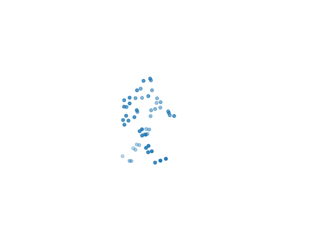

This repository hold generated samples of each perturbation techniques used in the paper "Understanding Person Identificatin through Gait" accepted at PoPETs 2023. Clear.gif gives the original sequence before the perturbation. We used the videos as stimuli in our user study to study how natural the results are perceived by the users. Following we give an overview of the perturbation techniques.

## Overview of the perturbation techniques

|                | Marcro                              | Micro                                           | Static                        | Dynamic                |
|----------------|-------------------------------------|-------------------------------------------------|-------------------------------|------------------------|
| definition     | Step length, walking speed, cadence | asymmetry and variability in the macro features | Shape and general body layout | Time course of changes |
| Perturbation 1 | Remove variations                   | Remove trajectories                             | Static pose                   | Motion Extraction      |
| Perturbation 2 |                                     | Amplitude/frequency equalization                | Resampling                    | Normalization          |
| Perturbation 3 | Coarsening macro                    | Coarsening micro                                |                               |                        |
| Perturbation 4 | Remove body parts                   | Keep body parts                                 |                               |                        |

## Description of the perturbation techniques

# Macro Features
The macro features keep the overall characteristics of the walker and remove its smaller variations from the data. We used three perturbation techniques for this: remove variations, coarsening macro, and remove body parts.

**Remove variations**: In order to extract the ideal trajectory from the gait data we removed the small variations that deviate from the ideal trajectory. The ideal trajectory is here calculated by two different methods: either using a moving window on the marker poses and then calculating a rolling average, or an interpolation. The difference between the two is that the rolling average takes all poses in the window to calculate an average, while the interpolation only uses the poses at the edge of the moving window. 
The moving window size is given as the distance to the pose which is calculated and is either one or three additional poses before and after e.g., spanning three poses in total or spanning seven poses in total, respectively. This strategy follows a similar idea to low-pass filtering, as it retains the main movement but removes detailed deviations.

**Coarsening macro**: As we were interested in the most significant information of the walker position, we removed the least significant part of each marker position in a pose for all poses. The effect is that the grid on which the walker moves is becoming more coarse. We removed all digits either below the thousandth (1000) or the hundredth digit (100).

**Remove body parts**: We measured how much an individual body part (head, torso, hip, arms, legs) contributes to the overall recognition performance. This was done by removing the body part from the data by setting its marker positions to zero.

# Micro Features
The micro features are the counterparts to the macro features. Here we kept the small variations of the gait cycle and the least significant parts of the marker positions.

**Remove trajectories**: Contrasting remove variations, we removed the ideal marker trajectories from the data by calculating the ideal trajectory as described in remove variation via either rolling average or interpolation with a window size of 1 or 3. The ideal trajectory was then subtracted from the real trajectory, which leaves us with the distances of the ideal marker positions to the real ones. 
This strategy resembles high-pass filtering, as it removes the main movement and only retains the minor specifics of the current sample.

**Coarsening micro**: We eliminated the most significant part of the walker positions by removing the most significant parts of each marker position value. We removed all digits above the hundredth (100), tenth (10), or first digit (1) position

**Keep body part**: We measured how much recognition performance the individual body parts have alone without the rest of the body. All remaining other body parts are set to zero.

**Amplitude/Frequency equalization**: The walking amplitude and frequency were equalized between all individuals to perturb their influence on the recognition. Informed by previous studies, we calculated a gait representation of each individual by using the average pose, the first four components of a principal component analysis (PCA), and a sinus function fit on these components to represent the gait cycle of a person. We then equalized the frequency or amplitude of the fitted sinus function by means of the group-level average.

# Static Features
The static features capture the time-invariant features of the walker by removing the dynamic part of the gait motion. We therefore kept the proportions of the walker.

**Static pose**: We used only an average pose or the first pose of each sample, thus removing the dynamic component of the gait data.

**Resampling**: We downsampled the data to 10 frames, and therefore removed most of the dynamic content from the data.

# Dynamic Features
The dynamic features are the counterpart to the static features and aim to only retain the dynamic part of the motion.

**Motion extraction**: Instead of using the individual poses, we used their difference (i.e., keeping only the variations between poses) and hence removed the static features.

**Normalization**: We normalized the static features in a sequence by either normalizing the height axis (y-axis), all axes or normalizing each dimension over the entire sequence of poses.

